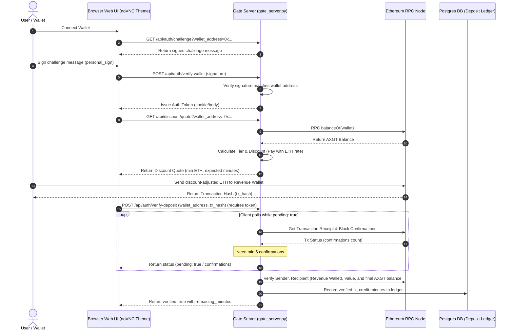

# 🧬 AxonOS Technical User Flow & System Architecture

This document outlines the workflows and architecture of the AxonOS gateway, billing verification engine, and session orchestration layer.

---

## 🏛️ 1. High-Level System Architecture

The client communicates with the gate over HTTPS endpoints (and a WebSocket only in the legacy single-container noVNC mode). The gate verifies Web3 signatures, checks on-chain deposits via Ethereum/Base RPC nodes, persists credit balances in PostgreSQL, and schedules session containers dynamically using the local Docker CLI or a remote HTTP launcher service. Session desktops are streamed to the browser over **WebRTC** (signaling via `/api/webrtc/*`, media peer-to-peer or through TURN — see [WEBRTC.md](./WEBRTC.md)); the **Direct SSH** toggle launches a headless container that exposes only `sshd` on a per-session port.

```mermaid
graph TD
    Client["Web Browser (landing page / workspace UI)"] <--> |Port 6080: HTTP API + WebRTC signaling| Gate["Gate Server (websockify_gate.py / gate_server.py)"]
    Gate <--> |Auth, Deposit & Audit Ledgers| DB[("PostgreSQL DB (axgt_deposits, axgt_verified_deposits, axgt_ledger)")]
    Gate <--> |JSON-RPC (balanceOf & tx checks)| EthRPC["Ethereum RPC (AXGT/ETH) + Base RPC (USDC/x402)"]
    Gate --> |Claim / Heartbeat / Status| SM["Session Manager (session_manager.py)"]
    SM --> |Spawn / Stop Adapter| SL["Session Launcher (session_launcher.py)"]
    SL --> |"Launcher Mode (CLI or HTTP API)"| HostLauncher["Host Docker Launcher / CLI"]
    HostLauncher --> |Manage Lifecycle| DockerContainers["AxonOS Session Containers (XFCE + WebRTC agent, or headless sshd)"]
    DockerContainers -.-> |WebRTC media (H.264/Opus) or SSH| Client
```

Payment rails all feed the same prepaid-minutes ledger: ETH (with AXGT holder discount, shown below), USDC by tx hash (`POST /api/auth/verify-usdc-deposit`, same holder discount), x402 for autonomous agents (`GET /api/x402/access`, `POST /api/x402/session`), and optionally direct AXGT deposits. Invite-gated wallet-free **guest / demo sessions** (`/api/auth/guest-invite`, `/api/auth/guest`) bypass the deposit flow for a fixed number of minutes. See [TOKENOMICS.md](./TOKENOMICS.md) for pricing and the dynamic USD price oracle.

---

## 🔑 2. Web3 Authentication & Deposit-Credit Flow

Users must prove wallet ownership via an EIP-191 challenge-signature process. Once authenticated, users can retrieve a server-calculated discount quote based on their current on-chain AXGT balance. Paying the discounted ETH amount to the revenue wallet grants user minutes after transaction confirmation checks.



---

## ⚡ 3. GPU Session Scheduler & Billing Heartbeat

During session creation, the client claims a resource profile (`small` = 1 GPU, `medium` = 2, `large` = 4, `max` = 8). Requests from different wallets are handled concurrently; the scheduler uses a short atomic reservation transaction so each physical GPU remains exclusive, then launches reserved containers concurrently. If the requested capacity is unavailable, the claim returns an immediate capacity response (`machine_total_gpus`, `machine_free_gpus`, `capacity_note`) and the client may retry — there is no launcher queue. A claim also requires at least as many prepaid minutes as GPUs in the profile. During active sessions, a runtime heartbeat daemon inside the container (`AXGT_HEARTBEAT_INTERVAL_SECONDS`, default 30 s) incrementally bills credits proportional to the profile's GPU weight; a paused / detached session is kept alive by the same mechanism. When credit runs out the container, jobs, and GPUs are retained for a top-up grace (`AXGT_SESSION_CREDIT_GRACE_MINUTES`, default 120).

```mermaid
sequenceDiagram
    autonumber
    actor User as User
    participant UI as Browser Web UI
    participant SM as Session Manager (session_manager.py)
    participant SL as Session Launcher (session_launcher.py)
    participant DB as Postgres DB (Deposit Ledger)
    participant Docker as Docker Engine

    %% Claim Session
    User->>UI: Claim Session (Select GPU Profile: Small/Med/Large/Max)
    UI->>SM: POST /api/session/claim (requested_profile)
    SM->>DB: Query remaining_minutes for wallet
    DB-->>SM: Return remaining_minutes
    alt remaining_minutes < required_minutes (GPUs count)
        SM-->>UI: Error: Insufficient credits
    else Credits OK
        SM->>SM: Check for available physical GPUs
        alt Free GPUs >= Profile GPUs
            SM->>SM: Assign exclusive GPU IDs
            SM->>SL: Launch Session (Profile, Container details)
            SL->>Docker: Spawn container with --gpus='"device=ID1,ID2"'
            Docker-->>SL: Container ID / Port
            SL-->>SM: Success
            SM->>DB: Update Session status (active)
            SM-->>UI: Launch details (compute session ID, WebRTC signaling or SSH host/port)
        else Not enough free GPUs
            SM-->>UI: Immediate capacity response (free vs. needed GPUs, capacity_note); client may retry
        end
    end

    %% Billing Heartbeat Loop
    loop Every 30 seconds (runtime daemon in the container; browser also heartbeats while connected)
        UI->>SM: POST /api/session/heartbeat (auth token)
        SM->>DB: Deduct elapsed minutes * GPU weight from remaining_minutes
        DB-->>SM: Return new balance (remaining_minutes)
        alt remaining_minutes <= 0
            SM->>DB: Mark credit_grace and checkpoint billing time
            SM-->>UI: Credit exhausted (viewer access and compute billing stop)
            Note over Docker: Same container, jobs, and GPUs keep running for 2h
            alt User tops up within 2h
                UI->>SM: Claim existing session
                SM->>DB: Mark active; reset billing checkpoint to now
                SM-->>UI: Reconnect to same container and allocation
            else Grace expires
                SM->>SL: Stop Session
                SL->>Docker: Stop and remove container
                SM->>DB: Mark session ended
            end
        else Credits OK
            SM-->>UI: Heartbeat Response (Ok, remaining_minutes)
        end
    end
```
